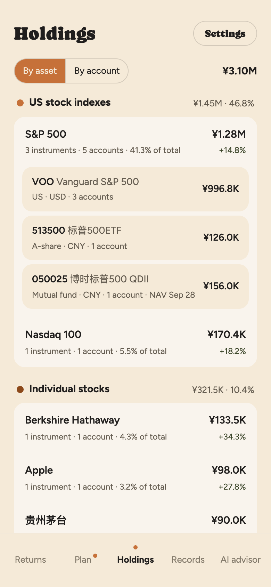
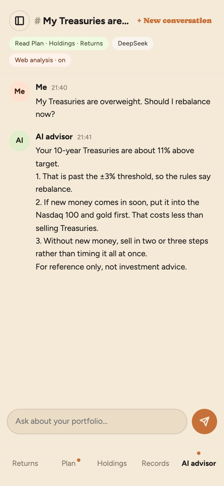
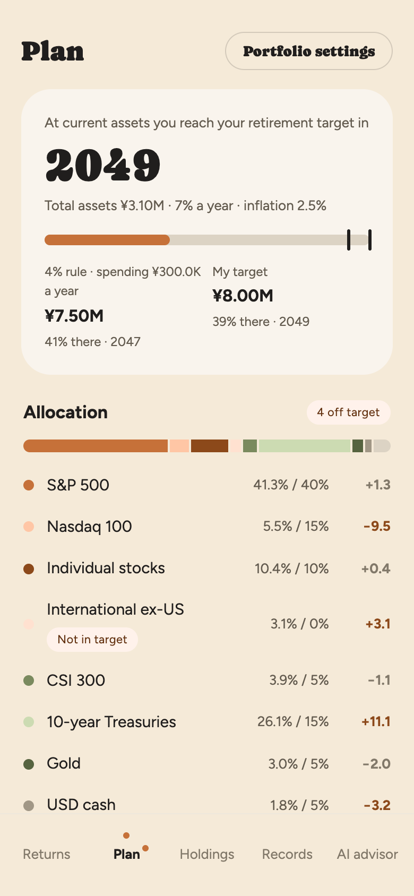
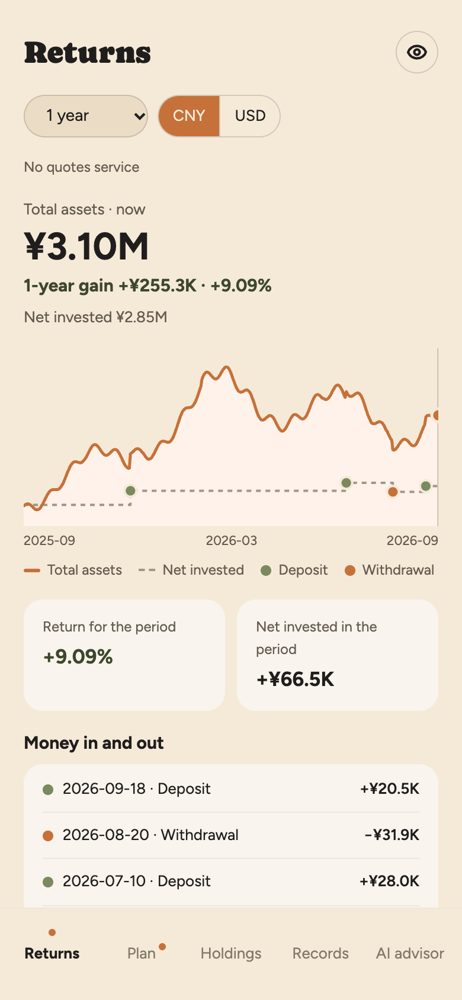
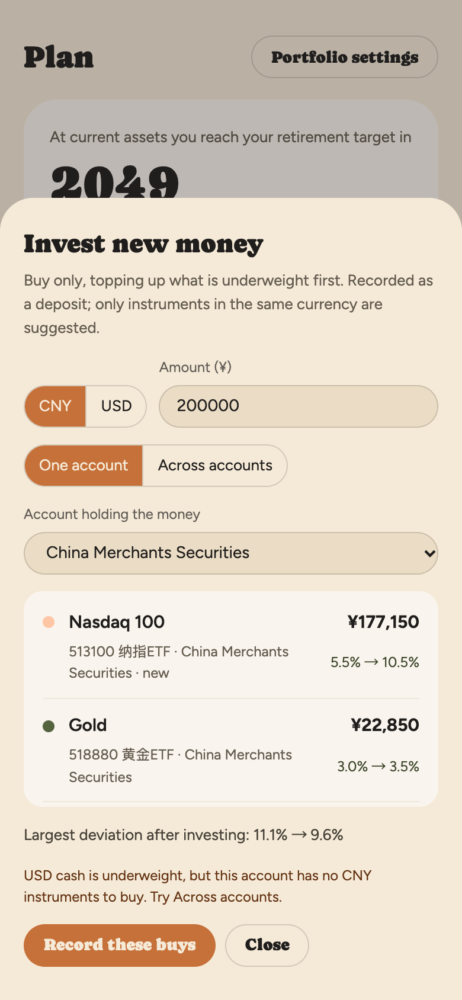
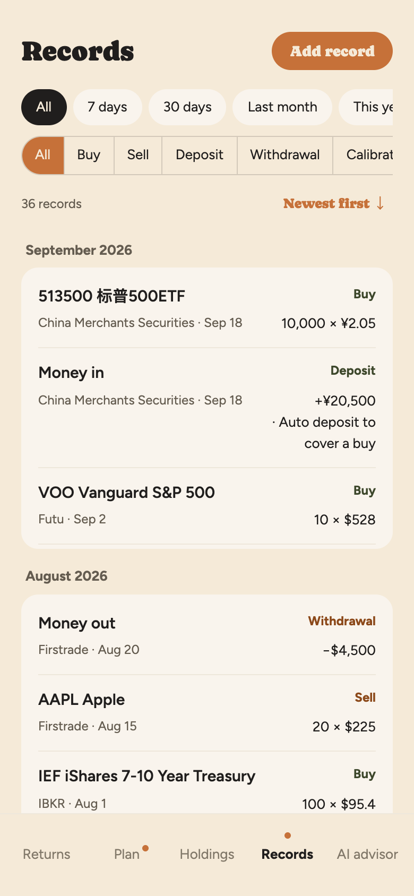

# AI Investment Manager

**English** | [简体中文](README.zh-CN.md)

[](https://github.com/ztwang1992/ai-investment-manager/actions/workflows/ci.yml)
[](LICENSE)

**Every broker, every currency, one portfolio, merged by what you actually own. With an AI advisor that runs on your own key.**

AI Investment Manager is a mobile-first, local-first web app (PWA) for people who invest through several brokers and in more than one currency. It merges your holdings by underlying asset, keeps the portfolio on a target allocation with a few calm rules, and lets an AI model of your choice analyze your real numbers. The AI advises; it never trades or touches your money.

<p>
  
  
  
</p>

<sub>Screenshots use the built-in sample data. The interface comes in English and Simplified Chinese.</sub>

## Highlights

### Holdings merged by what you actually own

Say you own the S&P 500 three ways: VOO at a US broker, 513500 on an A-share account and a QDII fund at your bank. Each app shows its own slice, in its own currency, and none of them can tell you how much S&P 500 you really have. Here they add up to one line, **S&P 500 · ¥1.28M · 41.3% of the portfolio**, and lets you open it by instrument and by account.

- **Three layers**: underlying asset → instrument → platform. View by asset or by account.
- **Targets live on the asset, not the ticker.** Buy the S&P 500 at any broker and in any currency; it all counts toward the same target.
- **Suggestions you can carry out.** *Invest new money* only buys, filling the most underweight assets first. *Withdraw* sells the most overweight first. Both stay in the currency of the money, because cash can't jump between a USD and a CNY account.
- **A real USD view.** Each daily snapshot keeps that day's exchange rate, so the USD chart shows what the currency did instead of the CNY line rescaled.

### An AI advisor that reads your portfolio, on your own key

Connect your own model key and ask in plain words: *"My Treasuries are overweight. Should I rebalance now?"* The advisor already knows your plan, holdings, drift and returns, so there is nothing to export, screenshot or paste.

The privacy comes from how it is built, not from a promise:

- **Your key stays on your phone.** It is encrypted with a non-extractable key in IndexedDB, and never uploaded, synced, backed up or logged. It is sent only to the provider you chose.
- **No middleman.** The browser talks to the model provider directly; no server of ours sits in between.
- **Nothing is shared until you agree.** After that, each question carries a summary: totals, allocation and returns by asset and account. Account numbers, sign-in details and individual transactions are never sent.

It works with DeepSeek today, through its OpenAI-compatible API. More providers are coming.

## Where your data goes

| Data | Stored | Sent to |
|---|---|---|
| Your AI key | Your phone only, encrypted | The model provider you chose, with each question |
| Portfolio and transactions | Your phone, synced to your own Supabase project (row-level security on every table) | Your own quotes Worker, for the daily snapshot |
| Portfolio summary | Not stored | The model provider, only after you agree |
| AI conversations | Your phone and your own Supabase project | The model provider: the last few messages, as context |
| Quote lookups | Not stored | Your own quotes Worker, as ticker codes only |

## Everything else

<p>
  
  
  
</p>

- **Returns**: total assets against net invested principal, from one week to all time, plus each asset's performance and the money that moved in and out.
- **Plan**: drift for every asset, step-by-step rebalancing, a reminder when drift passes your threshold, and the year you reach your retirement target.
- **Records**: every buy, sell, deposit, withdrawal and calibration, with filters, CSV export and a full JSON backup.
- **Calibration**: enter the share count your broker shows. Total cost stays the same, and an unchanged count is recorded as checked. Large holdings and dividend-reinvesting funds get a reminder each period.
- **Offline first**: record anything without a connection; it syncs when you're back online. It installs on the home screen like an app.
- **Set up in minutes**: enter each account's holdings and cash, and start from your current mix as the target.

## Try it in a minute

```bash
npm ci
npm run dev
```

Without a `.env.local`, the app opens straight to the sample data: nothing is saved and no quotes are fetched. To connect your own cloud, copy `.env.example` to `.env.local` and fill it in.

```bash
npm test
```

## Self-hosting

You need a Supabase project, a Cloudflare account with your own domain, an SMTP service for the sign-in emails (Resend works), and optionally a DeepSeek API key. All of it fits in the free tiers of Supabase, Cloudflare Workers and Resend; you pay only for the domain and your own AI usage.

1. **Supabase**: run the files in `supabase/migrations/` in order. Change the Magic Link and Confirm signup email templates to show the 6-digit code, and set up custom SMTP.
2. **Quotes Worker**: copy `worker/wrangler.example.jsonc` to `worker/wrangler.jsonc` and create a KV namespace. Fill in the domain, the KV id, `APP_ORIGIN` and `SUPABASE_URL`. Store the Supabase secret key with `npx wrangler secret put SUPABASE_SECRET_KEY --config worker/wrangler.jsonc`, then deploy.
3. **App**: build with `VITE_SUPABASE_URL`, `VITE_SUPABASE_ANON_KEY` and `VITE_API_BASE`, then deploy `dist/`. The root `wrangler.jsonc` deploys it as Cloudflare Worker static assets; any static host works.
4. **After your own account exists**, turn off new sign-ups in Supabase.

Step-by-step guides, each also in Chinese: [DEPLOY.md](DEPLOY.md), [docs/supabase-setup.md](docs/supabase-setup.md), [docs/worker-setup.md](docs/worker-setup.md).

## Under the hood

| Part | Technology | Code |
|---|---|---|
| App (PWA) | Vite, React 19, TypeScript, Zustand, Dexie (IndexedDB), vite-plugin-pwa | `src/` |
| Calculations | Pure TypeScript, unit-tested, shared by the app and the Worker | `src/domain/` |
| Data and sign-in | Supabase: Postgres with row-level security on every table, 6-digit email code sign-in | `supabase/migrations/` |
| Quotes, FX, daily snapshots | Cloudflare Worker with a KV cache and a daily cron (06:00 Beijing time) | `worker/` |
| AI advisor | The browser calls the provider's OpenAI-compatible API directly | `src/pages/ai/` |
| Languages | English source with a Simplified Chinese translation, no i18n library | `src/i18n/` |

**Rules the app keeps**

- **The ledger is the only source of truth.** Holdings, cash and principal are all derived from it by pure functions, and the Worker reuses the same functions for its daily snapshots.
- **Principal moves only with opening, deposit and withdrawal records.** Buying, selling and calibrating inside the portfolio never change it. Anything that changes principal is a record, never an edited number.
- **Cash is a holding**, with the code CNY or USD. A buy spends cash in the same currency; if there isn't enough, a deposit is recorded automatically.
- **Everything is computed in CNY internally** and converted for display. Cost in the original currency is kept separately.
- **Local first.** Writes go to IndexedDB and show up at once, then sync. Records are append-only; for settings, the last change wins.
- **Assets not in the target** (held, but missing from the target allocation) are either suggested for selling or left out of rebalancing, your choice.

**Tested like money depends on it.** Every money and ratio calculation is a pure, unit-tested function. More than 700 tests run on every push, including the database migrations and row-level security, against a real Postgres (PGlite).

**Two languages, one source.** Interface copy lives in `src/i18n/messages/`: English first, with the Chinese translation beside it, and the type checker keeps the two in step. A test fails if Chinese copy appears anywhere else in the code. Stored data stays as it was entered: preset names and automatic remarks are stored in Chinese and translated on display. Names of A-shares and Chinese mutual funds stay in Chinese.

The full product spec is [`design_handoff_investment_manager/README.md`](design_handoff_investment_manager/README.md) (in Chinese).

## Data sources

- **Quotes**: unofficial public endpoints of Tencent, Yahoo Finance and Sina for stocks and ETFs, and of Sina and Eastmoney for mutual funds (previous trading day's NAV). They can change or stop working at any time. Use them for personal purposes and respect their terms.
- **Exchange rates**: [Frankfurter](https://frankfurter.dev) (European Central Bank reference rates).

## How it was built

- The product spec and the interactive prototype are in [`design_handoff_investment_manager/`](design_handoff_investment_manager/).
- The app was built in phases following [`BUILD_PLAN.md`](design_handoff_investment_manager/BUILD_PLAN.md), and every phase plan is in [`docs/superpowers/plans/`](docs/superpowers/plans/).
- Product decisions and acceptance: me. Code: [Claude Code](https://claude.com/claude-code) (Anthropic's AI coding agent), test first. [`CLAUDE.md`](CLAUDE.md) holds the conventions it follows.

## Status

A personal project, shared as is. Issues are welcome, but replies and merged pull requests are not guaranteed.

## Disclaimer

This is not investment advice. Rebalancing suggestions and the AI advisor's answers are for reference only; your decisions are your own. The software is provided "as is", without warranty of any kind.

## License

[MIT](LICENSE) © 2026 Z.T.Wang
