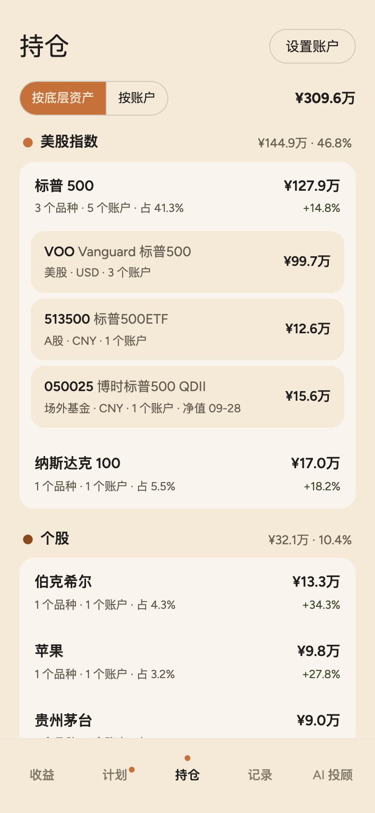
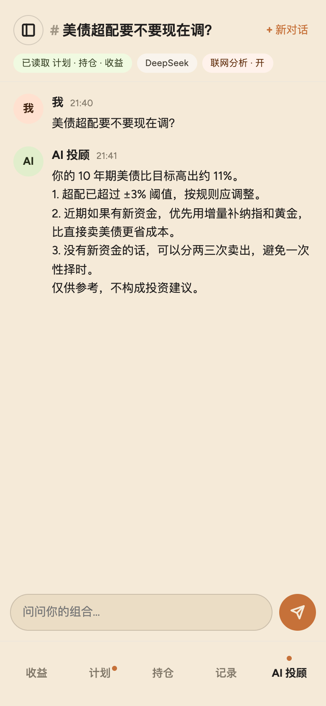
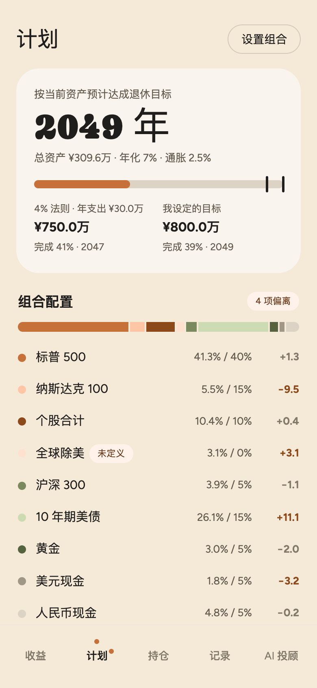
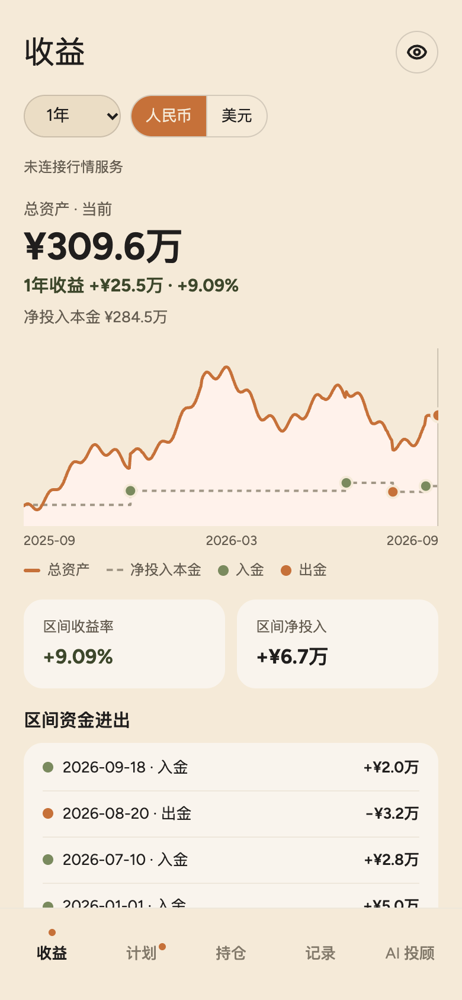
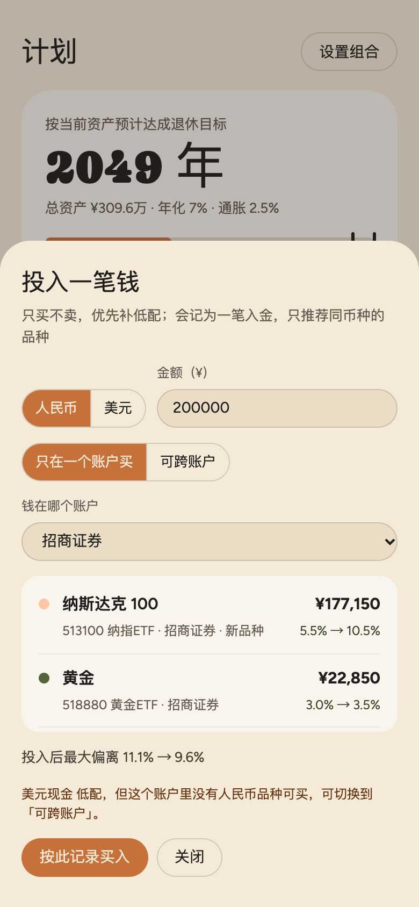
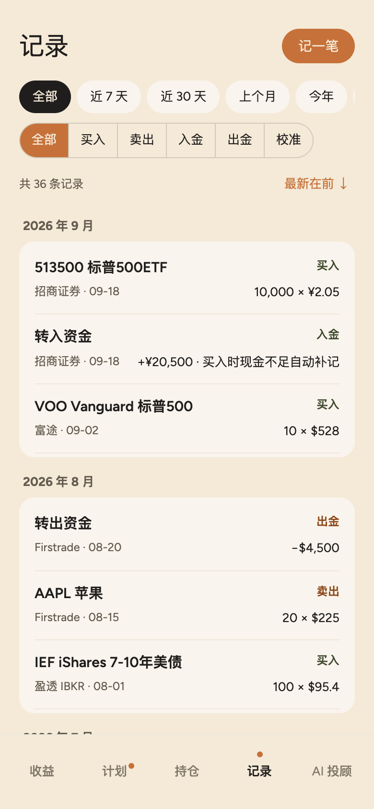

# AI 投资管理器 · AI Investment Manager

[English](README.md) | **简体中文**

[](https://github.com/ztwang1992/ai-investment-manager/actions/workflows/ci.yml)
[](LICENSE)

**多个券商、多种币种，一个组合：按你真正持有的底层资产合并。再加一个用你自己的 Key、读你自己数据的 AI 投顾。**

AI 投资管理器是一个手机优先、本地优先的网页 App（PWA），给在多个券商、用多种币种投资的人用。它把持仓按底层资产合并，用几条冷静的规则让组合保持在目标比例上，还能让你自己选的 AI 模型分析你真实的数据。AI 只给建议，不会替你下单，也碰不到你的钱。

<p>
  
  
  
</p>

<sub>截图用的是内置的示例数据。界面有英文和简体中文两种。</sub>

## 亮点

### 按底层资产合并持仓

假设你用三种方式持有标普 500：美股券商里的 VOO、A 股账户里的 513500、银行里的一只 QDII 基金。每个 App 只显示自己那一份，币种也不一样，没有一个能告诉你：你到底有多少标普 500。在这里它们合成一行，**标普 500 · ¥127.9万 · 占组合 41.3%**，点开能看每个品种，再点开能看每个账户。

- **三层结构**：底层资产 → 品种 → 平台；可以按资产看，也可以按账户看。
- **目标设在资产上，不设在代码上**：不管在哪个券商、用哪种币种买标普 500，都算进同一个目标。
- **建议能直接照着做**：「投入一笔钱」只买不卖，先补最低配的资产；「取钱」先卖超配最多的。两者都只用这笔钱的币种，因为美元账户和人民币账户之间的钱不能随手挪。
- **真正的美元视图**：每天的快照都记下当天的汇率，美元曲线反映的是汇率的真实变化，而不是把人民币曲线等比缩放。

### 接入 AI：用你自己的 Key，读你自己的数据

填上你自己的模型 Key，直接问：「美债超配要不要现在调？」AI 投顾已经读过你的计划、持仓、偏离和收益，不用导出、截图、复制粘贴。

隐私靠架构保证，而不是靠一句承诺：

- **Key 只在你的手机上**：用不可导出的密钥加密后存在本机（IndexedDB），从不上传、同步、备份，也不写进日志；只会发给你选的模型服务商。
- **没有中间人**：浏览器直接连模型服务商，中间没有我们的服务器。
- **你同意之前，什么都不发**：同意以后，每次提问只带一份汇总：按资产、按账户的总额、配置和收益。账户号码、登录信息和逐笔流水从不发送。

目前支持 DeepSeek（OpenAI 兼容接口），更多服务商在路上。

## 数据去了哪里

| 数据 | 存在哪里 | 会发给谁 |
|---|---|---|
| AI Key | 只在你的手机上，加密保存 | 你选的模型服务商，每次提问时 |
| 持仓和流水 | 你的手机，同步到你自己的 Supabase 项目（每张表都开启行级权限） | 你自己的行情 Worker，用来记每日快照 |
| 组合汇总 | 不保存 | 模型服务商，你同意之后 |
| AI 对话 | 你的手机和你自己的 Supabase 项目 | 模型服务商：最近几条消息，作为上下文 |
| 行情查询 | 不保存 | 你自己的行情 Worker，只有代码 |

## 其他功能

<p>
  
  
  
</p>

- **收益**：总资产和净投入本金的走势，从近一周到全部，还有各资产的表现和区间里的资金进出。
- **计划**：每个资产偏离多少、怎么一步步调回去；偏离超过阈值时提醒；估算哪一年达到退休目标。
- **记录**：买入、卖出、入金、出金、校准的流水，可以筛选，可以导出 CSV 或完整的 JSON 备份。
- **校准**：填券商显示的实际份额，总成本不变；份额没变时记为「已核对」。大额持仓和红利再投的品种每期提醒一次。
- **离线优先**：没网也能记账，联网后自动同步；可以添加到主屏幕，像 App 一样用。
- **几分钟录完**：按账户录入持仓和现金，可以直接把现在的比例当作目标。

## 一分钟试用

```bash
npm ci
npm run dev
```

没有 `.env.local` 时，App 直接显示示例数据：不保存，也不取行情。要连接自己的云端，把 `.env.example` 复制成 `.env.local` 再填好。

```bash
npm test
```

## 自己部署

需要：一个 Supabase 项目、一个绑定了自己域名的 Cloudflare 账号、一个发登录邮件用的 SMTP 服务（可以用 Resend）。DeepSeek API Key 可选。Supabase、Cloudflare Workers 和 Resend 的免费额度都够用，花钱的只有域名和你自己的 AI 用量。

1. **Supabase**：按顺序运行 `supabase/migrations/` 里的文件。把 Magic Link 和 Confirm signup 两个邮件模板改成直接显示 6 位验证码，并配置自定义 SMTP。
2. **行情 Worker**：把 `worker/wrangler.example.jsonc` 复制成 `worker/wrangler.jsonc`，建一个 KV 命名空间，填好域名、KV id、`APP_ORIGIN`、`SUPABASE_URL`。用 `npx wrangler secret put SUPABASE_SECRET_KEY --config worker/wrangler.jsonc` 存 Supabase 的 secret key，再部署。
3. **App**：构建时提供 `VITE_SUPABASE_URL`、`VITE_SUPABASE_ANON_KEY`、`VITE_API_BASE`，然后部署 `dist/`。根目录的 `wrangler.jsonc` 把它部署成 Cloudflare Worker 的静态资源；用别的静态托管也可以。
4. **自己的账号建好以后**，在 Supabase 里关闭新用户注册。

详细步骤见 [DEPLOY.zh-CN.md](DEPLOY.zh-CN.md)、[docs/supabase-setup.zh-CN.md](docs/supabase-setup.zh-CN.md)、[docs/worker-setup.zh-CN.md](docs/worker-setup.zh-CN.md)。

## 技术细节

| 部分 | 技术 | 代码 |
|---|---|---|
| App（PWA） | Vite、React 19、TypeScript、Zustand、Dexie（IndexedDB）、vite-plugin-pwa | `src/` |
| 计算 | 纯 TypeScript，有单元测试，App 和 Worker 共用 | `src/domain/` |
| 数据和登录 | Supabase：Postgres，每张表都开启行级权限；邮箱 6 位验证码登录 | `supabase/migrations/` |
| 行情、汇率、每日快照 | Cloudflare Worker，KV 缓存，每天北京时间 06:00 定时任务 | `worker/` |
| AI 投顾 | 浏览器直接请求服务商的 OpenAI 兼容接口 | `src/pages/ai/` |
| 多语言 | 英文为原文、简体中文为译文，不依赖 i18n 库 | `src/i18n/` |

**App 遵守的规则**

- **流水是唯一的事实来源**：持仓、现金、本金都由流水推导，推导函数都是纯函数；Worker 写每日快照时复用同一套函数。
- **本金只随期初、入金、出金流水变化**：组合内部的买卖、校准不影响本金。凡是改变本金的情况都落一条流水，不直接改数字。
- **现金也是持仓**，代码是 CNY 或 USD。买入时扣同币种的现金，不够时自动补记一笔入金。
- **内部统一用人民币计算**，显示时再换算；原币成本单独保存。
- **本地优先**：先写进本机的 IndexedDB、立即显示，再同步。流水只增不改；设置以最后修改的为准。
- **未定义资产**（有持仓、但不在目标组合里）由你选择：「建议卖出」或「不参与再平衡」。

**按管钱的标准来测试**：所有金额和比例的计算都是有单元测试的纯函数。每次推送都会跑 700 多个测试，数据库迁移和行级权限也在真实的 Postgres（PGlite）里一起测。

**两种语言，一套原文**：界面文案都在 `src/i18n/messages/` 里，先写英文，中文译文写在旁边，类型检查保证两边的条目一致；代码里别的地方出现中文文案，测试就会失败。已经存下的数据不翻译：预置品种的名称、自动补记的备注按中文存，显示时再按语言翻译；A 股和国内基金保留中文名称。

完整的产品说明见 [`design_handoff_investment_manager/README.md`](design_handoff_investment_manager/README.md)。

## 数据来源

- **行情**：股票和 ETF 用腾讯、Yahoo Finance、新浪的公开接口；场外基金用新浪和东方财富的公开接口（前一个交易日的净值）。这些都不是官方接口，随时可能变化或失效。仅供个人使用，请遵守各家的使用条款。
- **汇率**：[Frankfurter](https://frankfurter.dev)（欧洲央行参考汇率）。

## 怎么做出来的

- 产品说明和可交互的原型在 [`design_handoff_investment_manager/`](design_handoff_investment_manager/)。
- 按 [`BUILD_PLAN.md`](design_handoff_investment_manager/BUILD_PLAN.md) 分阶段开发，每个阶段的计划都在 [`docs/superpowers/plans/`](docs/superpowers/plans/)。
- 产品决定和验收：我。代码：[Claude Code](https://claude.com/claude-code)（Anthropic 的 AI 编程助手），先写测试再写实现。[`CLAUDE.md`](CLAUDE.md) 是它遵守的项目约定。

## 现状

这是一个个人项目，按现状分享。欢迎提 issue，但不保证回复，也不保证合并 PR。

## 免责声明

这不是投资建议。再平衡建议和 AI 投顾的回答仅供参考，决定由你自己做。软件按「现状」提供，不做任何担保。

## 许可证

[MIT](LICENSE) © 2026 Z.T.Wang
